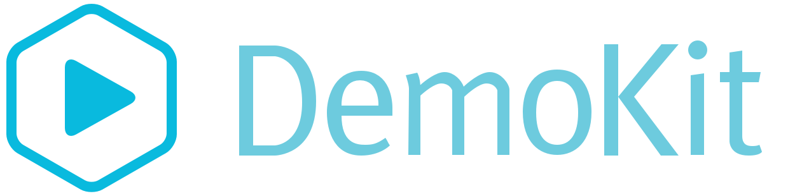

<div style="text-align:center">
    
</div>

---

DemoKit is a Library and Electron app for building product demos and tutorials using web technologies

* **Maintainable** Since DemoKit demos are just JavaScript modules, you can commit them
    to version control, diff them, collaborate with others, iterate and tweak to your heart's content, and
    simply re-capture the video if your product's UI ever changes. The videos for your product can
    now receive the same treatment as any other asset for your product instead of going stale.
* **Web Technologies** DemoKit uses the web technologies you already know and JSX ([without React](http://github.com/tolmasky/generic-jsx))
    to allow to specify the sequence of actions that take place in your demo. Creating professional
    looking product videos is as easy as using CSS.
* **Component-Based** DemoKit has a number of built-in components (or "props" in movie lingo) ready to
    to use for your demos. Browser windows that can load your site, terminal windows and code editor windows
    that can play supporting roles, and more. You can create and share custom components as well.

# Example

```jsx
<demo>
    <scene width = { 1024 } height = { 768 } />

    <browser    id = "duckduckgo"
                title = "Duck Duck Go"
                contentURL = "https://duckduckgo.com"
                contentRect = { { origin: { x: "center", y: "center" }, size: { width: 900, height: 600 } } } />

    <recording.start filePath = "videos/video" />

    <using window = "duckduckgo">
        <click selector = "input[type=text]" />
        <type>How do I use <paste>JSX</paste>?</type>
        <click selector = "input[type=submit]" />
    </using>

    <recording.stop />

</demo>
```

This example shows someone how to do a simple search on Duck Duck Go. It sets up the scene's size,
creates the browser window with the real duck duck go site loaded, and then proceeds to move the 
mouse and type in text. Once its completed, the video will be saved to "videos/video - CURRENT DATE".
That way you can keep running it without overwriting pre-existing takes.

We've also open sourced the video we made for our homepage at https://runkit.com/, which is available
here: https://github.com/runkitdev/runkit-demo.

# Installation

```
npm install demokit -g
```

# Usage

```
$ demokit new my-demo
$ demokit ./my-demo/index.js
```

The `new` command will create a template project for you. Simply edit the index.js, or add more files, and then run using the demokit command.

# Documentation

Visit the [Wiki](https://github.com/runkitdev/demokit/wiki/Home) for our documentation.

# Acknowledgments

This library would not have been possible without the awesome [PhotonKit](http://photonkit.com),
[CodeMirror](https://codemirror.net), [Smooth Scroll](https://github.com/cferdinandi/smooth-scroll),
[Screen Recorder](https://www.npmjs.com/package/screen-recorder), and although it is no longer a
dependency, [RobotJS](https://github.com/octalmage/robotjs).

# License

MIT
